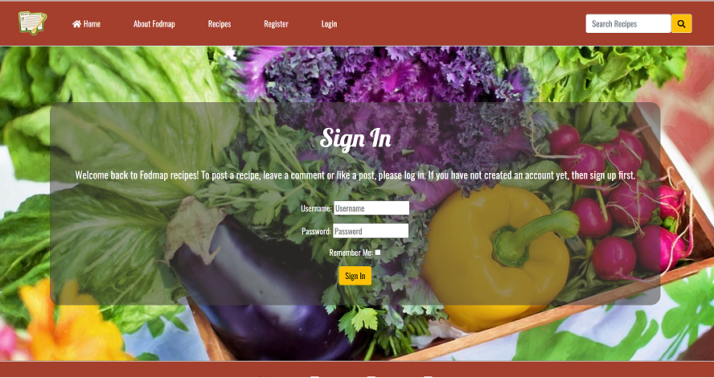
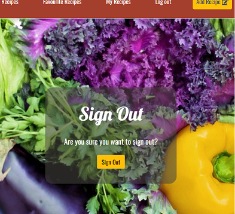

# Welcome to Fodmap recipes!
#### This is a site that provides Fodmap diet recipes. 

Fodmap is a diet to reduce symphtoms when having IBS and it is not always easy to find recipes that are Fodmap friendly. This site should be both inspiering and informative and make it easy to find tasty Fodmap recipes.  The site provides the user the oportunity to easy register an account. When logged in the user can upload their own recipe posts on the site (which the user then can update/edit/delete), comment and like other recipes and also watch their own liked/favourite recipes. If the user prefers not to register an account they can still look at the recipes uploaded and the About Fodmap site is open to all users.b  The site provides healthy recipes beneficial to all users and ages, and weather you follow the Fodmap diet or not.

#### [Deployed site](https://fodmap-recipes.herokuapp.com/)
------

## Table of contents

[UX](#ux)
- [User Stories](#user-stories)
- [Wireframes](#wireframes)
- [Agile Methodology](#agile-methodology)

[Existing Features](#existing-features)

- [Navbar](#navbar)
- [Home Page](#home-page)
- [Recipe details](#recipe-details)
- [About Fodmap](#about-fodmap)
- [Register](#register)
- [Signin](#signin)
- [Signout](#signout)
- [Footer](#footer)
- [Cloudinary API](#cloudinary-api)
- [Form and code validation](#form-and-code-validation)

[Technologies Used](#technologies-used)

- [Languages Used](#language-used)
- [Frameworks, Libraries & Programs Used](#frameworks-libraries-and-programs-used)
- [Database](#database-model-structure)

[Tests](#tests)

- [Automated Tests](#automated-tests)
- [Lighthouse](#lighthouse)

[Deployment](#deployment)

- [Deployment to heroku](#deployment-to-heroku)
- [Setting up local enviroment](#setting-up-local-environment)

[Credit](#credits)

## UX

------

### User Stories

GitHub issues were used to record the user stories. The user stories were categorised into different priorities.

### Wireframes

All wireframes are made using [Balsamiq](https://balsamiq.com/)

Wireframes for each device are linked here:
- [Desktop](assets/documents/Desktop-wireframes)
- [Tablet](assets/documents/Tablet-wireframes)
- [Mobile](assets/documents/Mobile-wireframes)

### Database scheme

### Agile Methodology

Github issues were used to create the User stories and acceptance criteria. Link to the project with live issues can be found [here](https://github.com/users/Karasp1980/projects/7).  

## Existing Features

------

### Navbar
For the navbar a red color is chosen with white text. An icon in the left corner is a decoration as well as a linke back to the homepage. When not logged in the navbar displays Home, Recipes, Register, Login. 

When having logged in the navbar displays Favourite recipes, My recipes and Logout as well as a "Add recipe" button instead. The add recipe button is in yellow to stand out and be easy to find, and also to match the login/logout button in the welcome section.

At the right side in the navbar there is also a searchbar, for all users (logged in or not). The search bar is also in yellow to match the yellow buttons.

### Home Page

The home page consists of a welcome hero image with a yellow clear login/register button (or when already logged in, a logout button). The hero image should be colorfol and inviting.

The next part of the home page is the recipe blog section, showing the latest 8 x2 blog posts entered (the last post in the upper left corner). The blog post showing consists of an image (if no image is not uploaded by the post creator a placeholder image is displayed) as well as the number of comments and likes and the date the post is published on. When clicking on the post link the full recipe with details is displayed on the "recipe details" page.

At the end of the "recently added recipes" section there is a "view all recipes" button that takes the user to the all_recipes/Recipes page with all recipes.

### Add recipe

When logged in the user can navigate to the "Add recipe" page by either clicking on the "Add recipe" button in the navbar or by clicking the "Add recipe" button at the top of "My recipes" page. The page incluedes a form with title, description, ingredients and preparation steps sections that the user can fill in. The user could also make som design desictions since the crispy forms is used. Finally the user could upload an image (if no image is choosen a placeholder image same as the welcome section image is displayed). When all fields are filled out the "Add recipe" button is clicked to save the recipe and be redirected to the recipes page (recipe_details). The recipe should now be found in the "recently added recipes" section on the homepage, the reciped page as well as in the users "My recipes" page (where it can be edited or deleted). If the user does not want to add the recipe the "back" button could be clicked to come back to the homepage.

### Recipe details

The recipe details page consists of the recipe uploaded by the user displaying the title/image uploaded (if not a placeholder image, which is the same image as the hero image on the home page), description, ingredients and preparation steps. 

Under the recipe secion there comes the like and comment section. When logged in the user can like and comment the recipe. To like a recipe you click the heart icon and it then changes color from transparent to red (or back to transparent if unlike).

To comment a recipe you fill out the comment form and click the submit button. A message then appears that the comment is avaiting approval. When the administrator has approved the comment it will be displayed in the comment section.

If not logged in, the user can only see the comments and likes made by others.

### About Fodmap
The About Fodmap shoud be an informative site about the Fodmap diet. It consists of a presentation what Fodmaps are and why the diet could be beneficial when having IBS and sensitive stomach, with the same style as the welcome section on the home page. It then consists of an image illustrating the process when starting the Fodmap diet in order to first eat only low Fodmap diet and slowly try medium Fodmap grocerys in order to find out what grocerys that gives symptoms and in what portion sizes. After the image there comes two fileds with Low Fodmap and High Fodmap grocerys, the first in green to aware the user that this is the grocerys to choose, and the High Fodmap grocerys in red to implicit that these foods should be avoided. Information about the diet is mainly taken right from the Monash University, where the diet is "founded" and where scientific trials on different food has been performed.

### Recipes
The Recipes/"all recipes"  site displays all recipes added to the site, 4x3 posts per page.

### Favourite recipes
When logged in the user can see all recepies that they have liked on the "Favourite recipes" site to make it easy to save recipe and find.

### My recipes with CRUD 
When logged in, the user can navigate to the "My recipes" page where all their own posted recipes are found. 4x2 recipes are displayed at each page. 

Underneath each recipe the user can edit or delete the recipe.

When clicking on the edit button the user come to the recipe form page and can edit all the details and save the changes by clicking the green "edit" button. If the user does not want to change anything they can click the "back" button.

When clicking on the delete button the user come to the "delete recipe" site wher they are asked "Are you sure you want to delete this recipe?" and if so the user can click the red delete button. If the user does not want to change anything they can click the "back" button.

### Register
The user could register for an account by register a username, email (optional) and password

### Sign in
When having registered an account the user could easily login byt entering username and password.

### Sign out
The signout page has the same style as the sign in page.

### Footer
The footer is in the same red color as the navbar with white text. It displays social media links to Facebook, Instagram and Twitter.

### Cloudinary API

For images the cloud based API Cloudinary is used. When a user uploads an image, it is saved in Cloudinary.

### Form and code Validation

Form Validation

1. HTML validation using HTML attribute
2. CSS Validation
3. Javascript validation
4. Django form validation

## 1. HTML Validation

| File Name | Result |
| ------ | ------ |
| base.html |  |
| index.html |  |
| post_detail.html |  |
| add.html |  |
| edit.html |  |
| delete.html |  |
| category.html |  |

**2. CSS Validation**
CSS file was tested by W3C css validation and everything was well. Screenshot report shows below

**3. Javascript Validation**
This file was tested by jshint.com and everything was well.

**4. Django code validation**
PEP8online.com site is not available at the moment. Its corrently down and thats why I use pycodestyle in gitpod workspace. In the django framework, python code validation complated by gitpod workspace. It shows problem at starting like "line is too long" but now it fixed.

- No error found in gitpod workspace
- anushilon2022
  - asgi.py
  - settings.py
  - urls.py
  - wsgi.py

- No error found in gitpod workspace
- rsnblog
  - admin.py
  - apps.py
  - forms.py
  - models.py
  - tests.py
  - urls.py
  - views.py
  - env.py
  - manage.py

- Procfile
- readme.md
- requirements.txt

## Technologies Used

------

### Language Used

    - HTML 5
    - CSS 3
    - JavaScript
    - Python
    - Django

### Technologies and Program Used

    - GitHub
        The Git was used for version control
        Git issues were used for user stories
        GitPod was used as IDE to write the code and push to GitHub
    
    - Heroku
        The page was deployed to Heroku
    - PostgreSQL
        PostgreSQL was used as database for this project
    - Cloudinary storage
        Cloudinary used for storing static files
    - Allauth
        Allauth functionality used for page inloggning.

### Frameworks Libraries and Programs Used

    - Bootstrap 5
        Bootstrap was used to add style to the website.
    - Django
        This is python framework and used this project.
    - Database
        Database model schema structure added below

### Database Model Structure

## Tests

------

### Automated tests

Automated tests already fixed on W3School, JShint and pycodetest(gitpod)

### Lighthouse

The site was run through Lighthouse in Chrome dev tools has been run. 

## Deployment

### Deployment to heroku

## In the app

1. add the list of requirements by writing in the terminal "pip3 freeze --local > requirements.txt"
2. Git add and git commit the changes made

## Log into heroku

1. Log into [Heroku](https://dashboard.heroku.com/apps) or create a new account and log in

2. top right-hand corner click "New" and choose the option Create new app, if you are a new user, the "Create new app" button will appear in the middle of the screen

3. Write app name - it has to be unique, it cannot be the same as this app
4. Choose Region - I am in Europe
5. Click "Create App"

**The page of the project opens.**

1. Go to Resources Tab, Add-ons, search and add Heroku Postgres

2. Choose "settings" from the menu on the top of the page

3. Go to section "Config Vars" and click button "Reveal Config Vars".

4. Add the below variables to the list

    - Database URL will be added automaticaly
    - Secret_key - is the djnago secret key can be generated self
    - Cloudinary URL can be obtained from [cloudinary](https://cloudinary.com/) follow the steps on the website to register.
    - Google API key can be obtained [here](https://cloud.google.com/gcp?authuser=1)

## Go back to code

1. Procfile needs to be created in your app

'''
web: gunicorn PROJ_NAME.wsgi
'''

1. In settings in your app add Heroku to ALLOWED_HOSTS

2. Add and commit the changes in your code and push to github

## Final step - deployment

1. Next go to "Deploy" in the menu bar on the top

2. Go to section "deployment method", choose "GitHub"

3. New section will appear "Connect to GitHub" - Search for the repository to connect to

4. type the name of your repository and click "search"

5. once Heroku finds your repository - click "connect"

6. Scroll down to the section "Mamual Deploys"

7. Click choose "Deploy branch" and manually deploy

8. Click "Deploy branch"

Once the program runs:
you should see the message "the app was sussesfully deployed"

1. Click the button "View"

### Setting up local environment

1. Create Virtual enviroment on computer or use gitpod built in virtual enviroment feature.

2. Create env.py file in the top directory. It needs to contain those variables.

- Database URL can be obtained from [heroku](https://dashboard.heroku.com/), add PostgreSQL as an add on when creating an app.
- Secret_key - is the djnago secret key can be generated self.
- Cloudinary URL can be obtained from [cloudinary](https://cloudinary.com/) follow the steps on the website to register.

'''
os.environ["DATABASE_URL"] = "..."
os.environ["SECRET_KEY"] = "..."
os.environ["CLOUDINARY_URL"] = "..."
'''

1. Run command

'''
pip3 install -r requirements.txt
'''

## Credits

#### Inspiration and help has also come from the Code Institute projects [Hello Django]() and [I think therefore I blog]() .

### The image used are taken from:
* [Pixbay](https://pixabay.com/)
* [Monash University](https://www.monashfodmap.com) 

## The recipes are taken from:
* [BBC good food](https://www.bbcgoodfood.com)
* [Monash University](https://www.monashfodmap.com) 

## The facts about Fodmap were taken from:
* [Cleveland clinic](https://my.clevelandclinic.org/health/treatments/22466-low-fodmap-diet) 
* [Monash University](https://www.monashfodmap.com) 

#### The following sites has also been helpful:
* [W3Schools](https://www.w3schools.com/) 
* [P4 News](https://github.com/mamuzaan/Portfolio-P4-News) 
* [The Healthy Family](https://github.com/Iris-Smok/The-Healthy-Family-PP4)
* [Viva la nacho](https://github.com/Matthew-Hurrell/viva-la-nacho) 
* [Django project](https://docs.djangoproject.com/) 

