# Welcome to Fodmap recipes

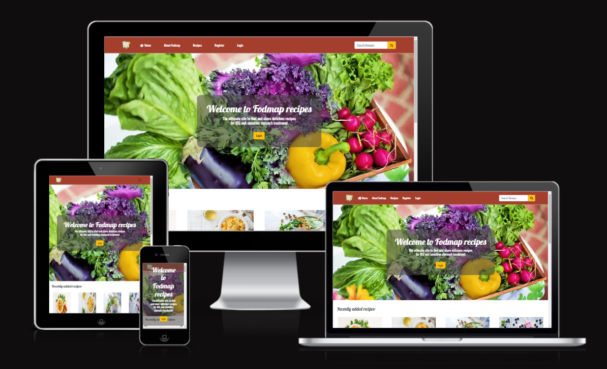

💻 [Visit live website](https://fodmap-recipes.herokuapp.com)

## Table of Contents
  - [About](#about)
  - [User Goals](#user-goals)
  - [Site Owner Goals](#site-owner-goals)
  - [User Experience](#user-experience)
  - [User Stories](#user-stories)
  - [Design](#design)
    - [Colours](#colours)
    - [Fonts](#fonts)
    - [Structure](#structure)
      - [Website pages](#website-pages)
      - [Database](#database)
    - [Wireframes](#wireframes)
  - [Technologies Used](#technologies-used)
  - [Features](#features)
  - [Validation](#validation)
  - [Testing](#testing)
    - [Manual testing of user stories](#manual-testing-of-user-stories)
    - [Automated testing](#automated-testing)
    - [Performing tests on various devices](#performing-tests-on-various-devices)
    - [Browser compatibility](#browser-compatibility)
  - [Bugs](#bugs)
  - [Improvements](#improvements)
  - [Deployment](#deployment)
  - [Credits](#credits)
  - [Acknowledgements](#acknowledgements)

### About

Fodmap is a diet to reduce symphtoms when having IBS and it is not always easy to find recipes that are Fodmap friendly. This site should be both inspiering and informative and make it easy to find tasty Fodmap recipes.  The site provides the user the oportunity to easy register an account. When logged in the user can upload their own recipe posts on the site (which the user then can update/edit/delete), comment and like other recipes and also watch their own liked/favourite recipes. If the user prefers not to register an account they can still look at all the recipes uploaded and the About Fodmap site and search function is open to all users. The site provides healthy recipes beneficial to all users in different ages, and weather you follow the Fodmap diet or not.

### User Goals

- Be able to find and search healthy Fodmap recipes
- Be able to add, comment and like recipes 
- Be able to manage own posted recipes and comments (edit/delete)

### Site Owner Goals

- Provide a recipe app with only Fodmap friendly recipe
- Create visually appealing design with inspiering recipes and images
- Provide fully responsive application with straightforward navigation

## User Experience

### Target Audience
- People with IBS trying to find Fodmap friendly recipes
- People in all ages with or without IBS problems that want to find healthy recipes

### User Requirements and Expectations

- Straightforward navigation
- Easy to use
- A responsive application that allows the user to access the app on any device
- Visually appealing design for all screen sizes
- Links and functions that work as expected
- An easy way to interact and comment other peoples recipes and give tips in the comments
- Accessibility

##### Back to [top](#table-of-contents)

## User Stories

##### Back to [top](#table-of-contents)

## Design

### Colours

The colour scheme was chosen to provide a simple, neutral and fresh look.

These colours were used throughout all the pages in such a way as to ensure adequate contrast and good user experience.
The red color #A43F2D seen in the header and footer for instance was chosen to be colorful but yet not taking over the content, and also match well with the plain white background and text. The grey #445261 also matches well with the other colors.

### Fonts

Google Fonts were implemented on the website. Lobster and Oswald with sans-serif as fallback was used thoughout the site to present the content in a clear and legible way.

### Structure

#### Website pages

Homepage, About Fodmap, Recipes, Add recipe, Recipe details, Favourite recipes, My recipes, search

#### Database

- The backend consists of Python built with the Django framework with a database of a Postgres for the deployed version
- Two database models contain all fields stored in the database and mimics the structure of what is actually stored in the Postgres database

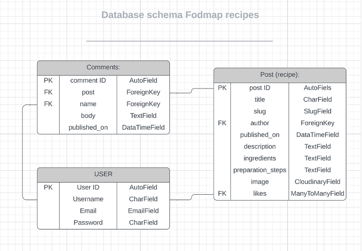

### Wireframes

All wireframes were created using [Balsamiq](https://balsamiq.com/)

Wireframes for each device are linked here:
- [Desktop](documents/desktop-wireframes)
- [Tablet](documents/tablet-wireframes)
- [Mobile](documents/mobile-wireframes)

## Technologies Used

### Languages & Frameworks

- HTML
- CSS
- Javascript
- Python 
- Django 

### Frameworks, Libraries & Programs Used

- [Heroku](https://www.heroku.com/) - Connected to the GitHub repository, Heroku is a cloud application platform used to deploy this project so the backend language can be utilised/tested. 
- [Django](https://www.djangoproject.com/) - This framework was used to build the foundations of this project
- [Am I Responsive](http://ami.responsivedesign.is/) was used to create the multi-device mock-up at the top of this README.md file
- [Balsamiq](https://balsamiq.com/) to create the projects wireframes
- [Bootstrap](https://getbootstrap.com/). This project uses the Bootstrap library for UI components (Buttons, Card, Footer, Modal, Pagination, Navbar)
- [Cloudinary](https://cloudinary.com/) to store static files
- [Lucid app](https://lucid.app/) wa used for the database schema diagram
- [Favicon.io](https://favicon.io) for making the site favicon
- [Chrome dev tools](https://developers.google.com/web/tools/chrome-devtools/) was used for debugging of the code and checking site for responsiveness
- [Font Awesome](https://fontawesome.com/) - Icons from Font Awesome were used throughout the site
- [Git](https://git-scm.com/) was used for version control within VSCode to push the code to GitHub
- [GitHub](https://github.com/) was used as a remote repository to store project code
- [Google Fonts](https://fonts.google.com/)
- [Postgres](https://www.postgresql.org/) – deployed project on Render uses a Postgres database
- [Summernote](https://summernote.org/) - editor used for exercise description field in Admin page
- [Pixabay](https://pixabay.com/)  - were used for all the images

- Validation:
  - [WC3 Validator](https://validator.w3.org/) was used to validate the html in the project
  - [Jigsaw W3 Validator](https://jigsaw.w3.org/css-validator/) to validate the css in the project
  - [JShint](https://jshint.com/) for JavaScript quality
  - [PEP8](http://pep8online.com/) to check code against Python conventions
  - [Lighthouse](https://developers.google.com/web/tools/lighthouse/) for performance, accessibility, progressive web apps, SEO analysis of the project code
  - [Wave Validator](https://wave.webaim.org/) to evaluate accessibility

##### Back to [top](#table-of-contents)

## Features

### Navbar
For the navbar a red color is chosen with white text. An icon in the left corner is a decoration as well as a linke back to the homepage. When not logged in the navbar displays Home, Recipes, Register, Login. 

When having logged in the navbar displays Favourite recipes, My recipes and Logout as well as a "Add recipe" button instead. The add recipe button is in yellow to stand out and be easy to find, and also to match the login/logout button in the welcome section.

At the right side in the navbar there is also a searchbar, for all users (logged in or not). The search bar is also in yellow to match the yellow buttons.

### Home Page

The home page consists of a welcome hero image with a yellow clear login/register button (or when already logged in, a logout button). The hero image should be colorfol and inviting.

The next part of the home page is the recipe blog section, showing the latest 8 x2 blog posts entered (the last post in the upper left corner). The blog post showing consists of an image (if no image is not uploaded by the post creator a placeholder image is displayed) as well as the number of comments (only approved/published comments are counted) and likes and the date the post is published on. When clicking on the post link the full recipe with details is displayed on the "recipe details" page.

At the end of the "recently added recipes" section there is a "view all recipes" button that takes the user to the all_recipes/Recipes page with all recipes.

At the end of the home page a section with the 3 "Most liked recipes" is added, starting whit the most liked recipe at the left side. This is a section to give the user inspiration for which recipes to try and a sight which recipes that has been most popular.

### Add recipe

When logged in the user can navigate to the "Add recipe" page by either clicking on the "Add recipe" button in the navbar or by clicking the "Add recipe" button at the top of "My recipes" page. The page incluedes a form with title, description, ingredients and preparation steps sections that the user can fill in. The user could also make som design desictions since the crispy forms is used. Finally the user could upload an image (if no image is choosen a placeholder image same as the welcome section image is displayed). When all fields are filled out the "Add recipe" button is clicked to save the recipe and be redirected to the recipes page (recipe_details). The recipe should now be found in the "recently added recipes" section on the homepage, the reciped page as well as in the users "My recipes" page (where it can be edited or deleted). If the user does not want to add the recipe the "back" button could be clicked to come back to the homepage.

### Recipe details

The recipe details page consists of the recipe uploaded by the user displaying the title/image uploaded (if not a placeholder image, which is the same image as the hero image on the home page), description, ingredients and preparation steps. 

Under the recipe secion there comes the like and comment section. When logged in the user can like and comment the recipe. To like a recipe you click the heart icon and it then changes color from transparent to red (or back to transparent if unlike). The user can also see the number of comments (when approved and deployed) made on that recipe.

To comment a recipe you fill out the comment form and click the submit button. A message then appears that the comment is avaiting approval. When the administrator has approved the comment it will be displayed in the comment section.

The user can edit/delete their own comments (when logged in). 

If not logged in, the user can only see the comments and likes made by others.

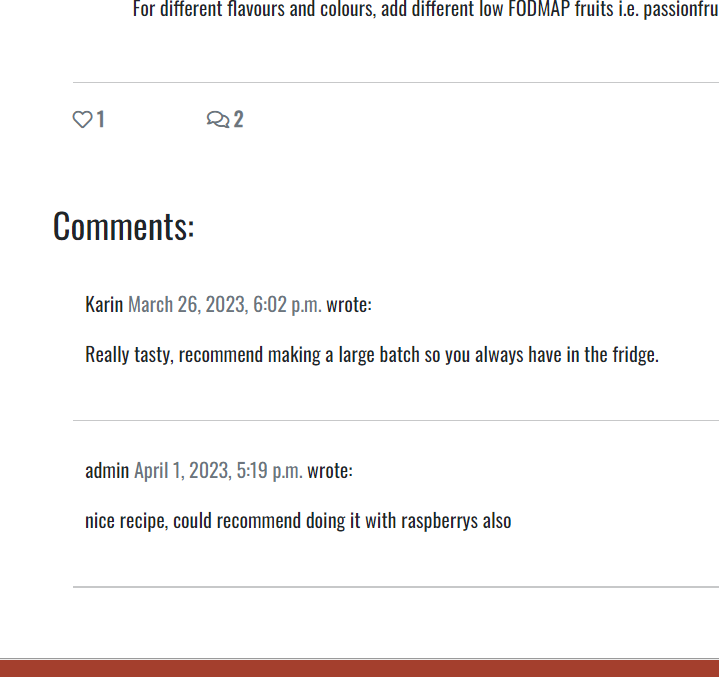

### About Fodmap
The About Fodmap shoud be an informative site about the Fodmap diet. It consists of a presentation what Fodmaps are and why the diet could be beneficial when having IBS and sensitive stomach, with the same style as the welcome section on the home page. It then consists of an image illustrating the process when starting the Fodmap diet in order to first eat only low Fodmap diet and slowly try medium Fodmap grocerys in order to find out what grocerys that gives symptoms and in what portion sizes. After the image there comes two fileds with Low Fodmap and High Fodmap grocerys, the first in green to aware the user that this is the grocerys to choose, and the High Fodmap grocerys in red to implicit that these foods should be avoided. Information about the diet is mainly taken right from the Monash University, where the diet is "founded" and where scientific trials on different food has been performed.

### Recipes
The Recipes/"all recipes"  site displays all recipes added to the site, 4x3 posts per page.

### Recipe details

### Favourite recipes
When logged in the user can see all recepies that they have liked on the "Favourite recipes" site to make it easy to save recipe and find.

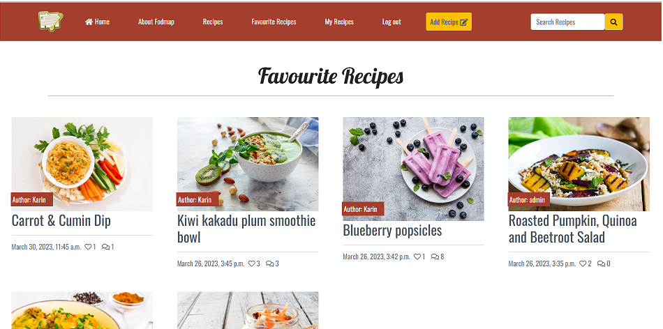

### My recipes with CRUD 
When logged in, the user can navigate to the "My recipes" page where all their own posted recipes are found. 4x2 recipes are displayed at each page. 

Underneath each recipe the user can edit or delete the recipe.

When clicking on the edit button the user come to the recipe form page and can edit all the details and save the changes by clicking the green "edit" button. If the user does not want to change anything they can click the "back" button.

When clicking on the delete button the user come to the "delete recipe" site wher they are asked "Are you sure you want to delete this recipe?" and if so the user can click the red delete button. If the user does not want to change anything they can click the "back" button.

### Register
The user could register for an account by register a username, email (optional) and password

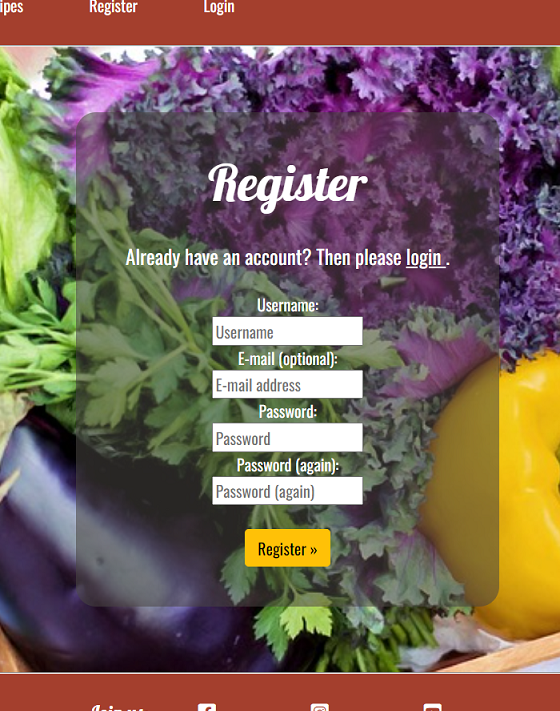

### Login
When having registered an account the user could easily login byt entering username and password.

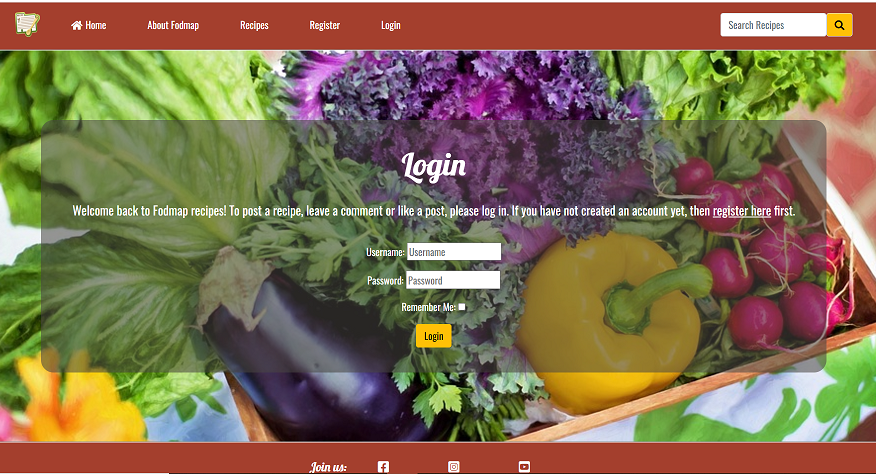

### Logout
The signout page has the same style as the sign in page.

### Footer
The footer is in the same red color as the navbar with white text. It displays social media links to Facebook, Instagram and Twitter.

### Cloudinary API

For images the cloud based API Cloudinary is used. When a user uploads an image, it is saved in Cloudinary.

## Validation

The W3C Markup Validation Service was used to validate the HTML of the website. No errors were found.

### CSS Validation
The W3C Jigsaw CSS Validation Service was used to validate the CSS of the website and it passes with no errors.

### PEP8 Validation/CI Python Linter
PEP8 Validation Service was used to check the code for PEP8 requirements. All the code passes with no errors and no warnings to show.

#### admin.py

#### settings.py

Only these four lines who were to long were left since it felt to risky to break them.

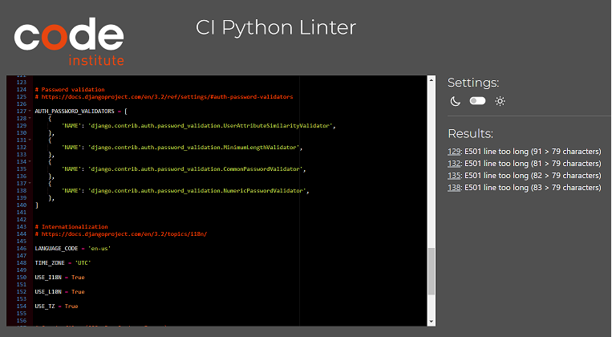

#### forms.py

#### models.py

#### urls.py

#### views.py

### Chrome Dev Tools Lighthouse

Lighthouse was used to test the performance, accessibility, best practice and SEO of the site.
Overall the results are very good for the 4 values even if the results shifted alot. But the image size for instance was optimized using [Tiny PNG](https://tinypng.com) 

#### Desktop

View results

##### Back to [top](#table-of-contents)

## Testing

The testing approach is as follows:
1. Manual testing of user stories
2. Automated testing

### Manual testing of user stories

The user stories are found here: [User stories](https://github.com/users/Karasp1980/projects/7)
an here [User stories Issues](https://github.com/Karasp1980/Fodmap-recipes/issues)

**Superuser / Admin**
- As a site Admin I can create, edit and delete recipes and comments so that I can manage the site content
- As a site Admin I can access the admin panel so that I can manage recipes and comments
- As a site Admin I can log out of the admin panel so that I can disconnect from the website

This was tested by accessing the Django Admin Panel. By creating a Superuser we can access the Django Admin Panel where the administrator can perform all the CRUD functionalitis

**User Interaction**
1. As a logged-in User I can write comments on recipes so that I can leave my feedback

2. As a logged-in User I can like and unlike recipes so that I can mark which recipes I like

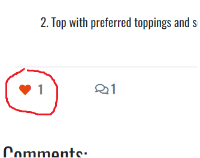

3. As a User I can view the number of likes on recipes so that I can see which recipes are the most popular

4. As a User I can view the number of comments (approved and publiced, if not approved the comment is not counted) on recipes so that I can see which recipes are the most commented.

5. As a User I can view comments on recipes so that I can read other users opinions

6. As a User I can see that my easily see a message after adding a recipe as well as edit or delete a recipe or comment so I can see it has been successfull

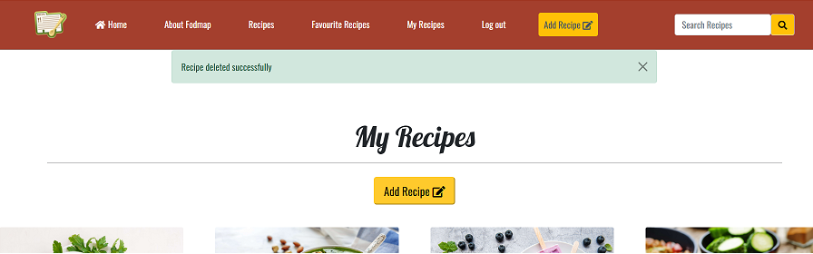

7. As a User I can get an error message when trying to add a recipe and not having filled in all the fields (or  using a title that already exists) so that I easily can see that a field is missing and correct that or change the title

**User Recipes**
1. As a logged-in User I can post a recipes so that other users can see them

2. As a User I can delete my recipes so that I can remove any unwanted recipes that I have made

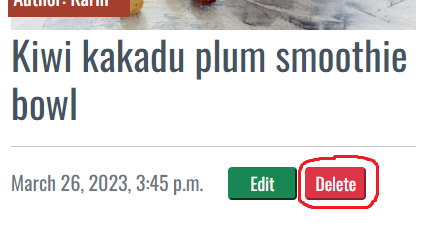

3. As a User I can edit recipes so that I can update any changes or mistakes to my recipes

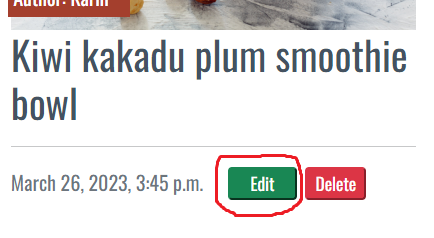

4. As a logged-in User I can upload an image along with my recipe so that other users can see what the dish looks like

**Login/Register**
1. As a User I can register for an account so that I can interact with the site content

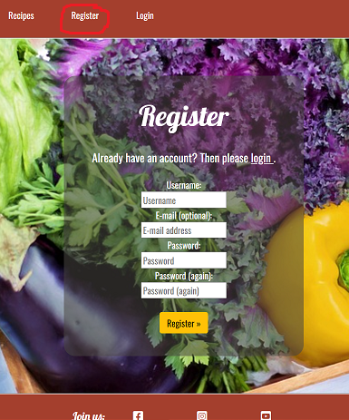

2. As a User I can log in/out off my account if I wish so that I can connect or disconnect from the website

3. As a User I can easily see if I'm logged-in or logged-out so that I can be sure what my status is

**Navigation**
1. As a User I can easily navigate through the site so that I can view desired content

2. As a User I can search the desirable recipe by keyword (in the recipe title or in the ingredients) so that I can find the recipe I want faster

3. As a User I can see the most loved recipes so that I can quickly find inspiration and see which recipes are most famous

4. As a User I can see the recently recipes so that I can keep up to date with the latest recipes

### Automated testing

Automated testing was done using the Django's unit tests from a Python standard library module: unittest. The reports were produced using the coverage tool.

#### test_views.py

#### test_forms.py

#### Unittest coverage
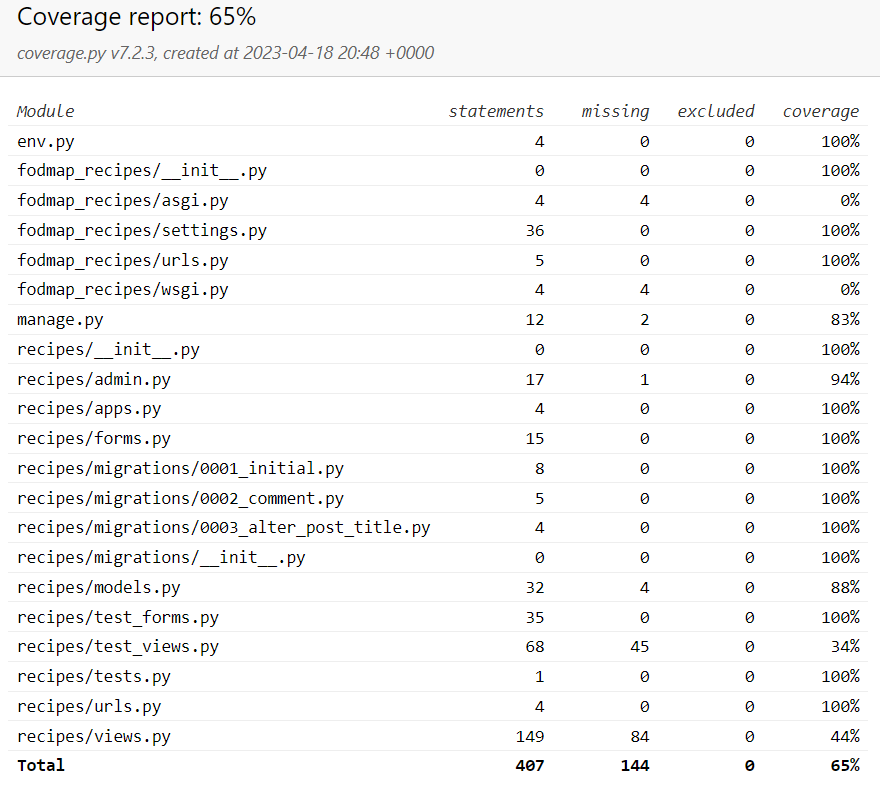

### Performing tests on various devices

The website was tested using Google Chrome Developer Tools Toggle Device Toolbar to simulate viewports of different devices; Google Chrome, Firefox and Microsoft Edge.

##### Back to [top](#table-of-contents)

## Bugs

## Improvements

Possible future improvements of the site could be:

* Adding a field in the top of the recipe_details page with cooking time and number of portions
* A user info site where the user can update/edit/delet their userinfo details
* Get the unittest coverage up to 100%

##### Back to [top](#table-of-contents)

## Deployment

This project was deployed using Github and Heroku.

## Github 
To create a new repository I took the following steps:

- Logged into Github.
- Clicked over to the ‘repositories’ section.
- Clicked the green ‘new’ button. This takes you to the create new repository page.
- Once there under ‘repository template’ I chose the code institute template from the dropdown menu.
- I input a repository name then clicked the green ‘create repository button’ at the bottom of the page.
- Once created I opened the new repository and clicked the green ‘Gitpod’ button to create a workspace in Gitpod for editing.

## Django and Heroku 
- To get the Django framework installed and set up I followed the Code institutes [Django Blog cheatsheet](https://codeinstitute.s3.amazonaws.com/fst/Django%20Blog%20Cheat%20Sheet%20v1.pdf)

##### Back to [top](#table-of-contents)

## Credits

#### Inspiration and help has also come from the Code Institute projects [Hello Django]() and [I think therefore I blog]() .

#### Images
The image used are taken from:
* [Pixbay](https://pixabay.com/)
* [Monash University](https://www.monashfodmap.com) 

#### Recipes
The recipes are taken from:
* [BBC good food](https://www.bbcgoodfood.com)
* [Monash University](https://www.monashfodmap.com) 

#### Facts
The facts about Fodmap were taken from:
* [Cleveland clinic](https://my.clevelandclinic.org/health/treatments/22466-low-fodmap-diet) 
* [Monash University](https://www.monashfodmap.com) 

#### Ohter
The following sites has also been helpful:
* [W3Schools](https://www.w3schools.com/) 
* [The Healthy Family](https://github.com/Iris-Smok/The-Healthy-Family-PP4)
* [Viva la nacho](https://github.com/Matthew-Hurrell/viva-la-nacho) 
* [Django project](https://docs.djangoproject.com/) 
* [Workout planner](https://github.com/aleksandracodes/CI_PP4_Workout_Planner)
* [Django documentation](https://docs.djangoproject.com/en/4.1/topics/class-based-views/generic-display/#adding-extra-context)
* [Django messages](https://docs.djangoproject.com/en/4.2/ref/contrib/messages/) 
