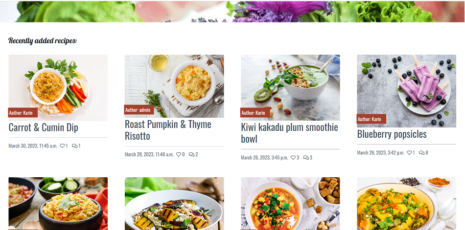
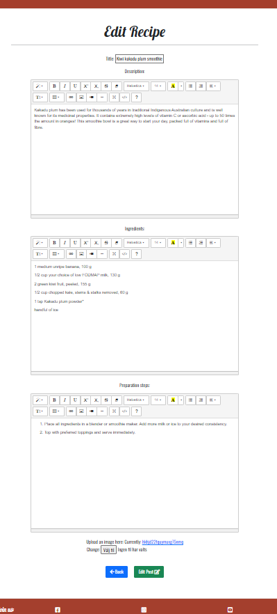

#Fodmap recipes 


💻 [Visit live website](https://fodmap-recipes.herokuapp.com)


## Table of Contents
  - [About](#about)
  - [User Goals](#user-goals)
  - [Site Owner Goals](#site-owner-goals)
  - [User Experience](#user-experience)
  - [User Stories](#user-stories)
  - [Design](#design)
    - [Colours](#colours)
    - [Fonts](#fonts)
    - [Structure](#structure)
      - [Website pages](#website-pages)
      - [Database](#database)
    - [Wireframes](#wireframes)
  - [Technologies Used](#technologies-used)
  - [Features](#features)
  - [Validation](#validation)
  - [Testing](#testing)
    - [Manual testing of user stories](#manual-testing-of-user-stories)
    - [Automated testing](#automated-testing)
    - [Performing tests on various devices](#performing-tests-on-various-devices)
    - [Browser compatibility](#browser-compatibility)
  - [Bugs](#bugs)
  - [Configuration](#configuration)
    - [Google emails](#google-emails)
    - [Forking the GitHub Repository](#forking-the-github-repository)
    - [Making a Local Clone](#making-a-local-clone)
  - [Credits](#credits)
  - [Acknowledgements](#acknowledgements)

### About

Fodmap is a diet to reduce symphtoms when having IBS and it is not always easy to find recipes that are Fodmap friendly. This site should be both inspiering and informative and make it easy to find tasty Fodmap recipes.  The site provides the user the oportunity to easy register an account. When logged in the user can upload their own recipe posts on the site (which the user then can update/edit/delete), comment and like other recipes and also watch their own liked/favourite recipes. If the user prefers not to register an account they can still look at the recipes uploaded and the About Fodmap site is open to all users.b  The site provides healthy recipes beneficial to all users and ages, and weather you follow the Fodmap diet or not.

### User Goals

- Be able to find and search healthy Fodmap recipes
- Be able to add, comment and like recipes
- Be able to manage own posted recipes (edit/delete)

### Site Owner Goals

- Provide a recipe app with only Fodmap friendly recipe
- Create visually appealing design with inspiering recipes and images
- Provide fully responsive application with straightforward navigation


## User Experience

### Target Audience
- People with IBS trying to find Fodmap friendly recipes
- People in all ages with or without IBS problems that wants to find healthy recipes


### User Requirements and Expectations

- Straightforward navigation
- Easy to use
- A responsive application that allows the user to access the app on any device
- Visually appealing design for all screen size
- Links and functions that work as expected
- An easy way to interact and comment other peoples recipes and give tips in the comments
- Accessibility

##### Back to [top](#table-of-contents)


## User Stories

### Users

1.


### Site Owner
11.	


##### Back to [top](#table-of-contents)


## Design

### Colours

The colour scheme was chosen to provide simple, neutral and fresh look. It was an intention to keep the website for all range of users and avoid colour stereotype typically found in the gyms and sports centres such as bright green or blue.

These colours were used throughout all the pages in such a way as to ensure adequate contrast and good user experience.

The pallet created using [Coolors.co](https://coolors.co/)
<details><summary>See colour pallet</summary>

</details>

### Fonts

Google Fonts were implemented on the website. Lobster and Oswald with sans-serif as fallback was used thoughout the site to present the content in a clear and legible way.

### Structure

#### Website pages


#### Database

- The backend consists of Python built with the Django framework with a database of a Postgres for the deployed version
- Two database models contain all fields stored in the database and mimics the structure of what is actually stored in the Postgres database

<details><summary>Show diagram</summary>

</details>


### Wireframes

<details><summary>Big screens - laptop & desktop</summary>

</details>
<details><summary>Medium screens - tablet</summary>

</details>
<details><summary>Small screens - mobile</summary>

</details>

## Technologies Used

### Languages & Frameworks

- HTML
- CSS
- Javascript
- Python 3.10.2
- Django 3.2


### Libraries & Tools

- [Am I Responsive](http://ami.responsivedesign.is/) was used to create the multi-device mock-up at the top of this README.md file
- [Balsamiq](https://balsamiq.com/) to create the projects wireframes
- [Bootstrap v5.1.3](https://getbootstrap.com/). This project uses the Bootstrap library for UI components (Buttons, Card, Footer, Modal, Pagination, Navbar)
- [Canva](https://www.canva.com/) was used to create a background image
- [Cloudinary](https://cloudinary.com/) to store static files
- [Dbdiagram.io](https://dbdiagram.io/home) used for the database schema diagram
- [Favicon.io](https://favicon.io) for making the site favicon
- [Chrome dev tools](https://developers.google.com/web/tools/chrome-devtools/) was used for debugging of the code and checking site for responsiveness
- [Font Awesome](https://fontawesome.com/) - Icons from Font Awesome were used throughout the site
- [Git](https://git-scm.com/) was used for version control within VSCode to push the code to GitHub
- [GitHub](https://github.com/) was used as a remote repository to store project code
- [Google Fonts](https://fonts.google.com/)
- [Render Platform](https://render.com) was used to deploy the project into live environment
- [jQuery](https://jquery.com) was used for drop-down exercises filters on smaller screens
- [Postgres](https://www.postgresql.org/) – deployed project on Render uses a Postgres database
- [Remove.bg](https://www.remove.bg/) was used to remove background on home page images & 404 page image
- [Summernote](https://summernote.org/) - editor used for exercise description field in Admin page
- [Visual Studio Code (VSCode)](https://code.visualstudio.com/) - code editor used to write this project
- Validation:
  - [WC3 Validator](https://validator.w3.org/) was used to validate the html in the project
  - [Jigsaw W3 Validator](https://jigsaw.w3.org/css-validator/) to validate the css in the project
  - [JShint](https://jshint.com/) for JavaScript quality
  - [PEP8](http://pep8online.com/) to check code against Python conventions
  - [Lighthouse](https://developers.google.com/web/tools/lighthouse/) for performance, accessibility, progressive web apps, SEO analysis of the project code
  - [Wave Validator](https://wave.webaim.org/) to evaluate accessibility

##### Back to [top](#table-of-contents)


## Features


### Navbar
For the navbar a red color is chosen with white text. An icon in the left corner is a decoration as well as a linke back to the homepage. When not logged in the navbar displays Home, Recipes, Register, Login. 


When having logged in the navbar displays Favourite recipes, My recipes and Logout as well as a "Add recipe" button instead. The add recipe button is in yellow to stand out and be easy to find, and also to match the login/logout button in the welcome section.


At the right side in the navbar there is also a searchbar, for all users (logged in or not). The search bar is also in yellow to match the yellow buttons.

### Home Page

The home page consists of a welcome hero image with a yellow clear login/register button (or when already logged in, a logout button). The hero image should be colorfol and inviting.


The next part of the home page is the recipe blog section, showing the latest 8 x2 blog posts entered (the last post in the upper left corner). The blog post showing consists of an image (if no image is not uploaded by the post creator a placeholder image is displayed) as well as the number of comments and likes and the date the post is published on. When clicking on the post link the full recipe with details is displayed on the "recipe details" page.



At the end of the "recently added recipes" section there is a "view all recipes" button that takes the user to the all_recipes/Recipes page with all recipes.

### Add recipe

When logged in the user can navigate to the "Add recipe" page by either clicking on the "Add recipe" button in the navbar or by clicking the "Add recipe" button at the top of "My recipes" page. The page incluedes a form with title, description, ingredients and preparation steps sections that the user can fill in. The user could also make som design desictions since the crispy forms is used. Finally the user could upload an image (if no image is choosen a placeholder image same as the welcome section image is displayed). When all fields are filled out the "Add recipe" button is clicked to save the recipe and be redirected to the recipes page (recipe_details). The recipe should now be found in the "recently added recipes" section on the homepage, the reciped page as well as in the users "My recipes" page (where it can be edited or deleted). If the user does not want to add the recipe the "back" button could be clicked to come back to the homepage.


### Recipe details

The recipe details page consists of the recipe uploaded by the user displaying the title/image uploaded (if not a placeholder image, which is the same image as the hero image on the home page), description, ingredients and preparation steps. 


Under the recipe secion there comes the like and comment section. When logged in the user can like and comment the recipe. To like a recipe you click the heart icon and it then changes color from transparent to red (or back to transparent if unlike).


To comment a recipe you fill out the comment form and click the submit button. A message then appears that the comment is avaiting approval. When the administrator has approved the comment it will be displayed in the comment section.


If not logged in, the user can only see the comments and likes made by others.


### About Fodmap
The About Fodmap shoud be an informative site about the Fodmap diet. It consists of a presentation what Fodmaps are and why the diet could be beneficial when having IBS and sensitive stomach, with the same style as the welcome section on the home page. It then consists of an image illustrating the process when starting the Fodmap diet in order to first eat only low Fodmap diet and slowly try medium Fodmap grocerys in order to find out what grocerys that gives symptoms and in what portion sizes. After the image there comes two fileds with Low Fodmap and High Fodmap grocerys, the first in green to aware the user that this is the grocerys to choose, and the High Fodmap grocerys in red to implicit that these foods should be avoided. Information about the diet is mainly taken right from the Monash University, where the diet is "founded" and where scientific trials on different food has been performed.

### Recipes
The Recipes/"all recipes"  site displays all recipes added to the site, 4x3 posts per page.


### Favourite recipes
When logged in the user can see all recepies that they have liked on the "Favourite recipes" site to make it easy to save recipe and find.


### My recipes with CRUD 
When logged in, the user can navigate to the "My recipes" page where all their own posted recipes are found. 4x2 recipes are displayed at each page. 


Underneath each recipe the user can edit or delete the recipe.


When clicking on the edit button the user come to the recipe form page and can edit all the details and save the changes by clicking the green "edit" button. If the user does not want to change anything they can click the "back" button.



When clicking on the delete button the user come to the "delete recipe" site wher they are asked "Are you sure you want to delete this recipe?" and if so the user can click the red delete button. If the user does not want to change anything they can click the "back" button.


### Register
The user could register for an account by register a username, email (optional) and password

### Login
When having registered an account the user could easily login byt entering username and password.


### Logout
The signout page has the same style as the sign in page.


### Footer
The footer is in the same red color as the navbar with white text. It displays social media links to Facebook, Instagram and Twitter.

### Cloudinary API

For images the cloud based API Cloudinary is used. When a user uploads an image, it is saved in Cloudinary.


## Validation

The W3C Markup Validation Service was used to validate the HTML of the website.
<details><summary>Home</summary>

</details>

<details><summary>Planner</summary>

</details>

<details><summary>Choose date</summary>

</details>

<details><summary>Add Plan</summary>

</details>

<details><summary>Edit Plan</summary>

</details>

<details><summary>View Plans</summary>

</details>

<details><summary>Exercises list page</summary>

</details>

<details><summary>Exercise detail page</summary>

</details>

<details><summary>Login</summary>

</details>

<details><summary>Signup</summary>

</details>

<details><summary>Profile</summary>

</details>

<details><summary>Logout</summary>

</details>

<details><summary>Contact form page</summary>

</details>

<details><summary>Error Pages (400, 403, 404, 500)</summary>

</details>

### CSS Validation
The W3C Jigsaw CSS Validation Service was used to validate the CSS of the website. When validating all website, it passes with no errors.

<details><summary>Style.css</summary>

</details>

### JavaScript Validation
JSHint JS Validation Service was used to validate the Javascript files. No errors were found.

<details><summary>Script.js</summary>

</details>

### PEP8 Validation
PEP8 Validation Service was used to check the code for PEP8 requirements. All the code passes with no errors and no warnings to show.

<details><summary>Exercises</summary>

<details><summary>Admin.py</summary>

</details>

<details><summary>Filters.py</summary>

</details>

<details><summary>Models.py</summary>

</details>

<details><summary>Test_views.py</summary>

</details>

<details><summary>Urls.py</summary>

</details>

<details><summary>Views.py</summary>

</details>

<details><summary>Exercises_tags.py</summary>

</details>

</details>

<details><summary>Home</summary>

<details><summary>Models.py</summary>

</details>

<details><summary>Test_views.py</summary>

</details>

<details><summary>Urls.py</summary>

</details>

<details><summary>Views.py</summary>

</details>

</details>

<details><summary>Plannerapp</summary>

<details><summary>Admin.py</summary>

</details>

<details><summary>Forms.py</summary>

</details>

<details><summary>Models.py</summary>

</details>

<details><summary>Test_views.py</summary>

</details>

<details><summary>Urls.py</summary>

</details>

<details><summary>Views.py</summary>

</details>

</details>


### Chrome Dev Tools Lighthouse

Lighthouse was used to test the performance, accessibility, best practice and SEO of the site.
Overall the results are very good for the 4 values.

#### Desktop
<details><summary>View results</summary>

Page  | Performance (%) | Accessibility (%) | Best Practices (%) | SEO (%)
------------  | ------------ | ------------- | ------------- | -------------
home/templates/home/index.html | 99 | 100 | 92 | 100 |
home/templates/home/contact.html | 100 | 100 | 92 | 100 |
home/templates/home/profile.html | 100 | 100 | 92 | 100 |
exercises/templates/exercises/exercises_list.html | 99 | 96 | 92 | 100 |
exercises/templates/exercises/exercise.html | 100 | 100 | 92 | 100 |
plannerapp/templates/plannerapp/add_plan.html | 100 | 93 | 92 | 100 |
plannerapp/templates/plannerapp/choose_date.html | 100 | 93 | 92 | 100 |
plannerapp/templates/plannerapp/edit_plan.html | 100 | 93 | 92 | 100 |
plannerapp/templates/plannerapp/planner.html | 100 | 98 | 92 | 100 |
plannerapp/templates/plannerapp/view_plans.html | 100 | 98 | 92 | 100 |
templates/account/login.html | 100 | 100 | 92 | 90 |
templates/account/signup.html | 100 | 100 | 92 | 100 |
templates/account/logout.html | 100 | 100 | 92 | 100 |

</details>

#### Mobile
<details><summary>View results</summary>

Page  | Performance (%) | Accessibility (%) | Best Practices (%) | SEO (%)
------------  | ------------ | ------------- | ------------- | -------------
home/templates/home/index.html | 99 | 100 | 92 | 100 |
home/templates/home/contact.html | 99 | 100 | 92 | 100 |
home/templates/home/profile.html | 99 | 100 | 92 | 100 |
exercises/templates/exercises/exercises_list.html | 75 | 98 | 92 | 100 |
exercises/templates/exercises/exercise.html | 99 | 100 | 92 | 100 |
plannerapp/templates/plannerapp/add_plan.html | 99 | 93 | 92 | 100 |
plannerapp/templates/plannerapp/choose_date.html | 99 | 92 | 92 | 100 |
plannerapp/templates/plannerapp/edit_plan.html | 98 | 93 | 92 | 100 |
plannerapp/templates/plannerapp/planner.html | 99 | 98 | 92 | 100 |
plannerapp/templates/plannerapp/view_plans.html | 97 | 98 | 92 | 100 |
templates/account/login.html | 98 | 100 | 92 | 92 |
templates/account/signup.html | 99 | 100 | 92 | 100 |
templates/account/logout.html | 99 | 100 | 92 | 100 |

</details>

### Wave
The WAVE WebAIM web accessibility evaluation tool was used to test the websites accessibility.

<details><summary>Home page</summary>

</details>

<details><summary>Contact page</summary>
- Initially there were 3 errors shown for no labels to input fields. This was fixed by adding labels and setting bootstrap class to sr-only.


</details>

<details><summary>Profile page</summary>

</details>

<details><summary>Exercises list</summary>

</details>

<details><summary>Exercise detail page</summary>

</details>

<details><summary>Choose date page</summary>

</details>

<details><summary>Add plan</summary>

- There were 28 errors identified related to missing form labels which were fixed and as a result there are no more errors identified. Same issues for edit plan page.
  

</details>

<details><summary>Edit plan</summary>

</details>

<details><summary>Planner page</summary>

- Initially there was one error related to the empty table header (1st th element), which was fixed by addiding value to the th element and setting 'visibility: none';


</details>

<details><summary>View plans</summary>

- A few errors related to empty links of navigation icons were corrected by adding aria-hidden='true' and setting bootstrap class to sr-only.
  

</details>

<details><summary>Login</summary>

</details>

<details><summary>Register</summary>

</details>

<details><summary>Logout</summary>

</details>

<details><summary>Error page</summary>

</details>

##### Back to [top](#table-of-contents)


## Testing

The testing approach is as follows:
1. Manual testing of user stories
2. Automated testing

### Manual testing of user stories

1. I want to see the home page with explanation of the app

**Step** | **Expected Result** | **Actual Result**
------------ | ------------ | ------------ |
Navigate to https://ci-pp4-workout-planner.onrender.com/ | Home page main body loads with application description | Works as expected |

<details><summary>Screenshot</summary>

</details>


2. I want to be able to easily navigate around the application to different pages

**Step** | **Expected Result** | **Actual Result**
------------ | ------------ | ------------ |
Click on 'Home' link on the navigation bar | Loads home page | Works as expected |
Click on 'Planner' link on the navigation bar | Loads planner page | Works as expected |
Click on 'Exercise' link on the navigation bar | Loads exercises page | Works as expected |
Click on User name on the navigation bar and then 'Profile' from the drop-down menu| Loads user profile page | Works as expected |
Click on User name on the navigation bar and then 'Log out' from the drop-down menu| Loads log out page | Works as expected |

<details><summary>Screenshot</summary>


</details>


3. I want to create my account to be able to plan my workouts

**Step** | **Expected Result** | **Actual Result**
------------ | ------------ | ------------ |
Select 'Log in' on the navigation bar and 'Register' from the drop-down menu | Loads Registration page | Works as expected |
Provide username | Shows error if username is shorter than 4 characters | Works as expected |
Provide password  | Shows error if password don't meet password criteria | Works as expected |
Click 'Register' button at the bottom of the form | User is logged-in, taken to the planner page and presented with a confirmation message | Works as expected |

<details><summary>Screenshot</summary>


</details>


4. I want to prepare a plan for multiple weeks in advance

**Step** | **Expected Result** | **Actual Result**
------------ | ------------ | ------------ |
Register or log in to the account to be able to create a plan | Loads planner page | Works as expected |
Click on the 'Add a new plan' button | Display a choose date page with a date picker | Works as expected |
Select first day for the plan and click 'Choose' | Loads add plan page with selected first day of the week  | Works as expected |
Fill in the plan and click 'Add plan' button | Loads view plans page with completed plan | Works as expected |
Click on the 2nd icon (Plus sign) from the navigation icons below the current plan and repeat two above steps | Create a new plan with a different start day | Works as expected |
Select first day from the date picker which has already been selected | Show error message and clear date picker for another selection | Works as expected |

<details><summary>Screenshot</summary>


</details>


5. I want to be able to edit my current plans at any point

**Step** | **Expected Result** | **Actual Result**
------------ | ------------ | ------------ |
In the view plans page click on the 1st icon from the navigation icons below the current plan | Loads edit page for selected workout plan | Works as expected |
Edit the plan and click on 'Save' button | Loads view plans page, displays confirmation message and shows amended plan | Works as expected |

<details><summary>Screenshot</summary>


</details>


6. I want to delete my plan if no longer needed

**Step** | **Expected Result** | **Actual Result**
------------ | ------------ | ------------ |
In the view plans page click on the 3rd icon from the navigation icons below the current plan | Displays confirmation modal | Works as expected |
Click on 'Delete' on the pop up modal | Deletes selected plan and displays confirmation message. Show current plans and if no plans are saved a relevant message for user | Works as expected |

<details><summary>Screenshot</summary>


</details>

7.  I want to see feedback messages so that I know that my plan was created, edited or deleted

**Step** | **Expected Result** | **Actual Result**
------------ | ------------ | ------------ |
Click on the 'Add a new plan' button on planner page, fill in the plan and click 'Add plan' button | Loads view plans page with completed plan | Works as expected |
 | Loads edit page for selected workout plan | Works as expected |
In the view plans page click on the 1st icon from the navigation icons below the current plan, edit the plan and click on 'Save' button | Loads view plans page, displays confirmation message and shows amended plan | Works as expected |
In the view plans page click on the 3rd icon from the navigation icons below the current plan, click on 'Delete' on the pop up modal | Deletes selected plan and displays confirmation message. Show current plans and if no plans are saved a relevant message for user | Works as expected |

<details><summary>Screenshot</summary>


</details>


8.  I want to be able to view previous plans to help me prepare the following week’s workout

**Step** | **Expected Result** | **Actual Result**
------------ | ------------ | ------------ |
Register or log in to the account to be able to view all plans | Loads planner page | Works as expected |
Click on 'View my current workout plans' button | Loads view plans page | Works as expected |
Use right & left arrows to navigate between created plans | Display previous & next plan | Works as expected |

<details><summary>Screenshot</summary>


</details>


9.  I want to find inspiration for my workouts and be able to use search option to find a particular exercise

**Step** | **Expected Result** | **Actual Result**
------------ | ------------ | ------------ |
Click on the 'Exercises' menu on the navigation bar | Loads exercises list page paginated by 12 | Works as expected |
Use filter to search a specific exercise depending on the body part, level or type | Displays exercises matching users criteria | Works as expected |
Type a name or part of the exercise name and click on the 'Search' button | Loads exercises containing searched phrase in their title | Works as expected |
Click on 'Clear' button to remove filter and display list of all exercises | Loads exercises list paginated by 12 | Works as expected |
Click on '>>' button in the pagination feature to go to the next page displaying next 12 exercises | Loads next 12 exercises from all exercises in the database | Works as expected |

<details><summary>Screenshot</summary>


</details>


10. As a returning user, I want to log in to the app to see my current plans

**Step** | **Expected Result** | **Actual Result**
------------ | ------------ | ------------ |
Click on 'Log in' on the navigation bar and 'Log in' from the drop-down menu | Loads Log in page | Works as expected |
Provide incorrect username & password | Shows error if username and/or password are not correct | Works as expected |
Provide correct username & password | Logs user in and loads a planner page. Displays confirmation message and username on the page screen and nav bar | Works as expected |
Click 'View my current workout plans' on the planner page | Loads view plans page | Works as expected |

<details><summary>Screenshot</summary>


</details>


11. I want every site visitor to be able to view the catalogue of exercises
    
**Step** | **Expected Result** | **Actual Result**
------------ | ------------ | ------------ |
Click on 'Exercises' on the navigation bar | Loads exercises list page | Works as expected |

<details><summary>Screenshot</summary>

</details>


##### Back to [top](#table-of-contents)


12. I want only the logged-in users to be able to create their plans

**Step** | **Expected Result** | **Actual Result**
------------ | ------------ | ------------ |
Click on 'Planner' on the navigation bar | For not logged-in users displays an example of the plan and option to log in or register | Works as expected |

<details><summary>Screenshot</summary>

</details>


13. I want users to be able to create the plan on any day that suits their needs

**Step** | **Expected Result** | **Actual Result**
------------ | ------------ | ------------ |
On planner page click 'Add a new plan' | Displays choose date page with a day picker | Works as expected |
Select any date on the calendar other than Monday, eg. Wednesday | Displays add plan page with Wednesday as the first day of the plan | Works as expected |
Choose other date of the week as a first day, eg. Saturday | Displays add plan page with Saturday as the first day of the plan | Works as expected |

<details><summary>Screenshot</summary>


</details>


14. I want data entry to be validated on sign-up page

**Step** | **Expected Result** | **Actual Result**
------------ | ------------ | ------------ |
Click on the 'Log in' on the nav bar and 'Register' from the drop-down menu | Displays Registration page | Works as expected |
Input username shorter than 4 characters (eg. xyz) | Prevents registration. Shows warning message to lenghten username text  | Works as expected |
Input username which has already been taken (eg. Admin) | Prevents registration. Displays 'A user with that username already exists.' message | Works as expected |
Input incorrect format of email | Shows warning message to include '@' in the email. Prevents registration | Works as expected |
Input 'newuser12' password |  Prevents registration. Displays 'The password is too similar to the username' message | Works as expected |
Input '12345678' as a password | Prevents registration. Displays 'This password is entirely numeric' message | Works as expected |
Input 'testing' as a password | Prevents registration. Displays 'This password is too short. It must contain at least 8 characters' message | Works as expected |
Input two different values in 'Password' and 'Password (again)' fields | Prevents registration. Displays 'You must type the same password each time.' message | Works as expected |

<details><summary>Screenshot</summary>


</details>


15. I want the user to come to a 404 error page instead of having to use the browser back button if they enter a URL that does not exist
    
**Step** | **Expected Result** | **Actual Result**
------------ | ------------ | ------------ |
Type the wrong page in the www address | Reroute to a customised 404 page | Works as expected |

<details><summary>Screenshot</summary>


</details>


16. I want user to be able to contact me and provide their feedback

**Step** | **Expected Result** | **Actual Result**
------------ | ------------ | ------------ |
Click on the envelope icon in the footer | Displays contact page with contact form | Works as expected |
For user who is not logged-in fill in username, email and message fields and click 'Send message' | Initially displays contact form with no data in and after completion sends the form | Works as expected |
For user who is logged-in and did not provide email on registration, fill in email and message fields and click 'Send message' | Initially displays contact form with prepopulated username and after input of email and message sends the form | It did not work when tested. User email was not shown in the received email. The code in home views.py was corrected and the feature re-tested. As documented in the screenshot below, it now works as expected. |
For user who is logged-in and provided email on registration, fill in the message fields and click 'Send message' | Initially displays contact form with prepopulated username and email address and sends the form with user message | Works as expected |


17. I want user to receive feedback if their message in contact form has been sent.

**Step** | **Expected Result** | **Actual Result**
------------ | ------------ | ------------ |
Click on the envelope icon in the footer | Displays contact page with contact form | Works as expected |
Fill in required contact form fields and click 'Send message' button | Display confirmation message to the user | Works as expected |


18. I want my site to be fully responsive

**Step** | **Expected Result** | **Actual Result**
------------ | ------------ | ------------ |
Change device screen size using chrome dev tools | The web functionality remains the same on various screen sizes | Works as expected |

<details><summary>Screenshot</summary>


</details>


19. I want to see details of a specific exercise and get an idea how to perform it correctly

**Step** | **Expected Result** | **Actual Result**
------------ | ------------ | ------------ |
Navigate to exercise page in the navigation bar | Displays the list of all exercises paginated by 12 | Works as expected |
Click 'View' button under an exercise picture and overview | Displays the selected exercise detail page | Works as expected for both logged in and not logged in user |

<details><summary>Screenshot</summary>


</details>


20. I want a paginated list of exercises so that I can easily select an exercise to view

**Step** | **Expected Result** | **Actual Result**
------------ | ------------ | ------------ |
Navigate to exercise page in the navigation bar | Displays the list of all exercises paginated by 12 | Works as expected |
Click on the '»' symbol to go to the next page | Displays next available page | Works as expected |
Click on the '»»' to jump to the last page | Displays last page | Works as expected  |
Click on the '«' symbol to go to the previous page | Displays previous available page | Works as expected |
Click on the '««' to jump to the first page | Displays first page | Works as expected  |
Put a filter on exercises and select only exercises for legs from the body part filter and click 'Search' | Displays only exercises matching the search criteria | Works as expected |
Test '»»' & '««' symbols to jump to the last / first page | Displays last / first page available | Works as expected |

<details><summary>Screenshot</summary>


</details>


21. I want to be able to log out from my account

**Step** | **Expected Result** | **Actual Result**
------------ | ------------ | ------------ |
On navigation bar click on username and select 'Log out' from the drop-down menu | Displays the log out page | Works as expected |
Click on the 'Log out' button | Logs user out and displays confirmation message | Works as expected |


<details><summary>Screenshot</summary>


</details>


22. I want to be able to see details of my account on the profile page

**Step** | **Expected Result** | **Actual Result**
------------ | ------------ | ------------ |
On navigation bar click on username and select 'Profile' from the drop-down menu | Displays the profile page | Works as expected |

<details><summary>Screenshot</summary>


</details>


23.  I want to be able to delete my account if I decide to no longer use the app

**Step** | **Expected Result** | **Actual Result**
------------ | ------------ | ------------ |
On navigation bar click on username and select 'Profile' from the drop-down menu | Displays the profile page | Works as expected |
Click on the 'Delete profile' button | Pops up modal to confirm user's decision and warns about the irreversibility of this action | Works as expected |
Click on the 'Delete' button to confirm the choice | Deletes the user account and displays the message on the main screen | Works as expected |

<details><summary>Screenshot</summary>


</details>


### Automated testing

Automated testing was done using the Django's unit tests from a Python standard library module: unittest. The reports were produced using the coverage tool.

- Exercises app:


- Home app:


- Plannerapp app:


### Performing tests on various devices

The website was tested using Google Chrome Developer Tools Toggle Device Toolbar to simulate viewports of different devices.

The website was tested on the following devices:
- ASUS ZenBook (tablet screen)
- Samsung Galaxy Tab A (tablet screen)
- Samsung S7 (mobile screen)

### Browser compatibility

- Testing has been carried out on the following browsers:
  - Googe Chrome Version 101.0.4951.41 (Official Build) (64-bit)
  - Firefox Browser 99.0.1 (64-bit)
  - Microsoft Edge Version 101.0.1210.32 (Official build) (64-bit)

##### Back to [top](#table-of-contents)


## Bugs

|

##### Back to [top](#table-of-contents)


## Configuration


### Forking the GitHub Repository
1. Go to the GitHub repository
2. Click on Fork button in top right corner
3. You will then have a copy of the repository in your own GitHub account.
   
### Making a Local Clone
1. Go to the GitHub repository 
2. Locate the Code button above the list of files and click it
3. Highlight the "HTTPS" button to clone with HTTPS and copy the link
4. Open commandline interface on your computer
5. Change the current working directory to the one where you want the cloned directory
6. Type git clone and paste the URL from the clipboard 
  ```
  $ git clone https://github.com/aleksandracodes/CI_PP4_Workout_Planner
  ```
7. Press Enter to create your local clone

##### Back to [top](#table-of-contents)


## Credits

#### Inspiration and help has also come from the Code Institute projects [Hello Django]() and [I think therefore I blog]() .

#### Images
The image used are taken from:
* [Pixbay](https://pixabay.com/)
* [Monash University](https://www.monashfodmap.com) 

#### Recipes
The recipes are taken from:
* [BBC good food](https://www.bbcgoodfood.com)
* [Monash University](https://www.monashfodmap.com) 

#### Facts
The facts about Fodmap were taken from:
* [Cleveland clinic](https://my.clevelandclinic.org/health/treatments/22466-low-fodmap-diet) 
* [Monash University](https://www.monashfodmap.com) 

#### Ohter
The following sites has also been helpful:
* [W3Schools](https://www.w3schools.com/) 
* [P4 News](https://github.com/mamuzaan/Portfolio-P4-News) 
* [The Healthy Family](https://github.com/Iris-Smok/The-Healthy-Family-PP4)
* [Viva la nacho](https://github.com/Matthew-Hurrell/viva-la-nacho) 
* [Django project](https://docs.djangoproject.com/) 
* [Workout planner](https://github.com/aleksandracodes/CI_PP4_Workout_Planner)